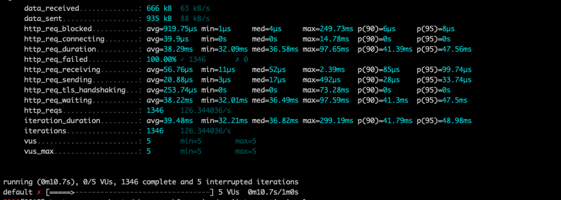
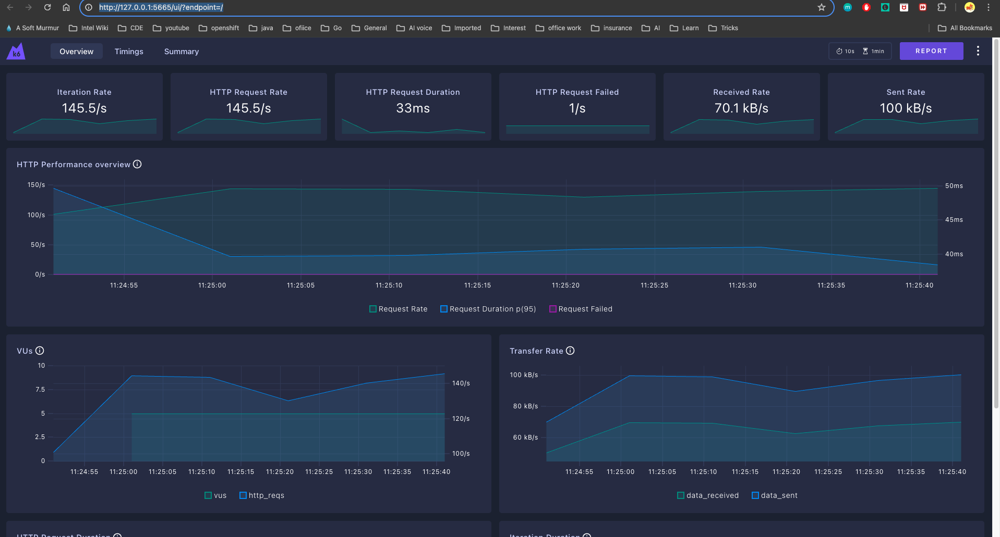

# Run k6 load test
It is simple tool to use for a load test and see response in local.

1. Use k6 to run load test (more info can be found in https://k6.io/docs/get-started/installation/).
2. you can write you own scenario in javascript and test like for example 
    ```
        import http from "k6/http";

        export let options = {
        vus: 5, // Number of virtual users to simulate concurrently
        duration: '60s', // Duration of the test (adjust as needed)
        };
        /*export const options = {
        // iterations: 1,
        stages: [
            {duration: "30s", target: 10000},
            {duration: "5m", target: 10000},
            {duration: "1m", target: 0}
        ]
        };*/

        let headers = {
            authorization: "Bearer xyz"
        };

        export default function () {
        const response = http.get("https://<URL>", {headers : headers});
        // Print the response headers
        console.log("Resp code :" + response.status);
        if (response.status !== 200) {
            // Print the reason why the request failed
            console.error(`Request failed: ${response.error}`);
        }

        //console.log("Resp code :" + response.status);
        //console.log(response.body);
        }
    ```
3. To run you can "k6 run first.js" which will print output as 
    
4. To run and see ouput in webUI u can use "K6_WEB_DASHBOARD=true k6 run first.js" and open http://127.0.0.1:5665/ui/?endpoint=/
    
    and much more info
5. It is simple tool to use for a load test and see response in local.


